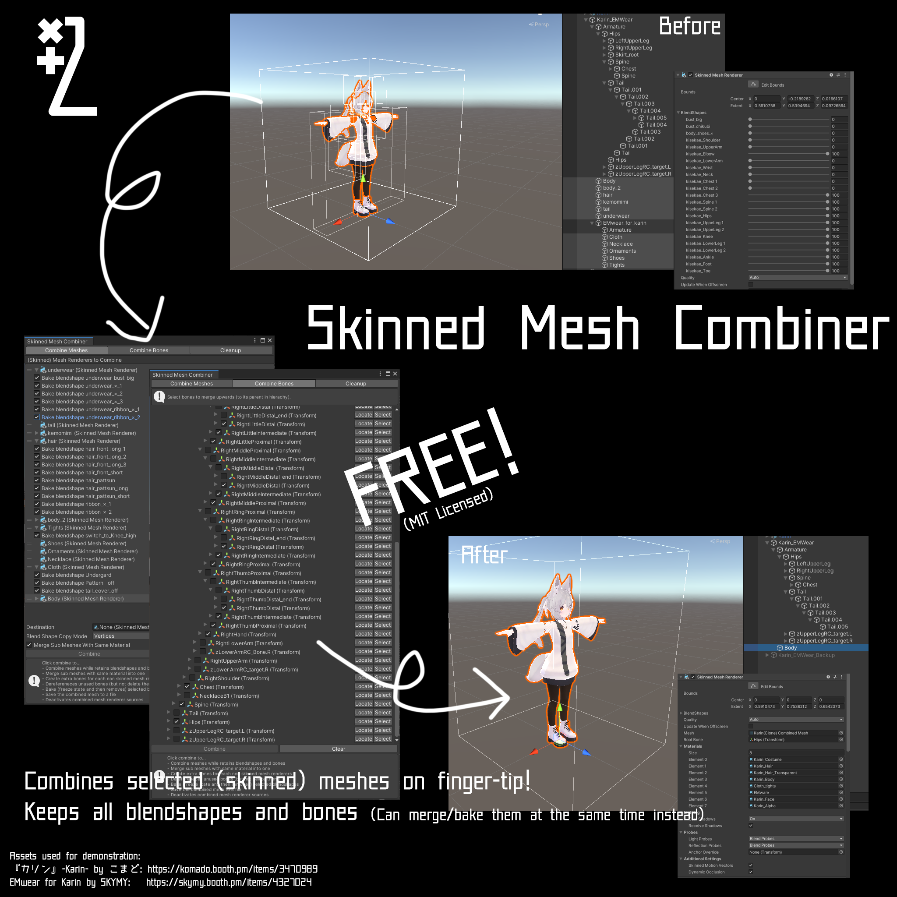
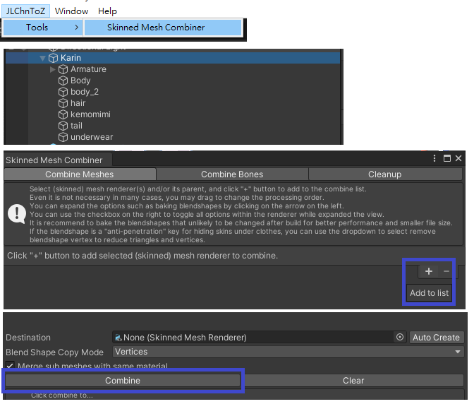
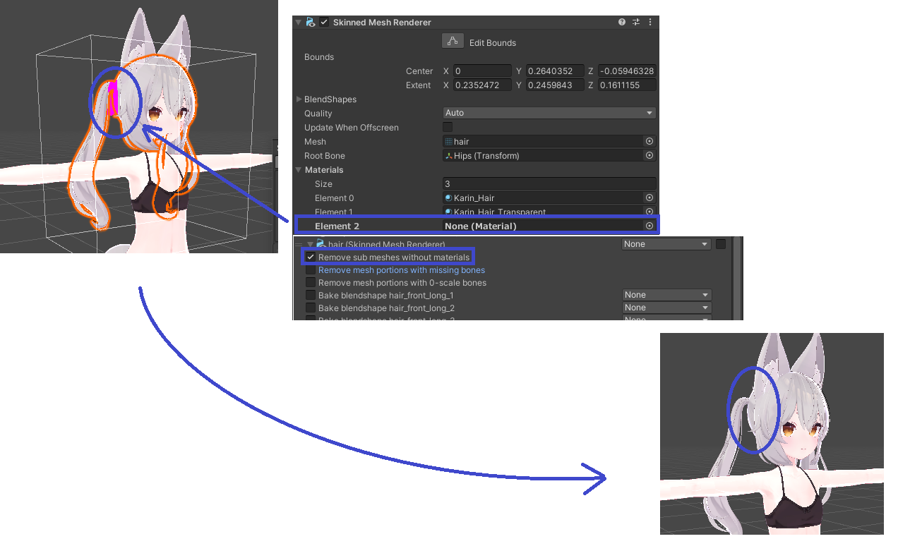
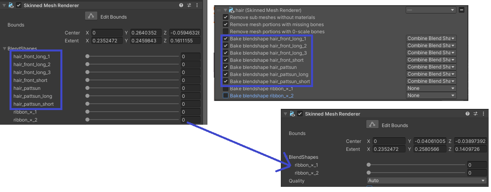
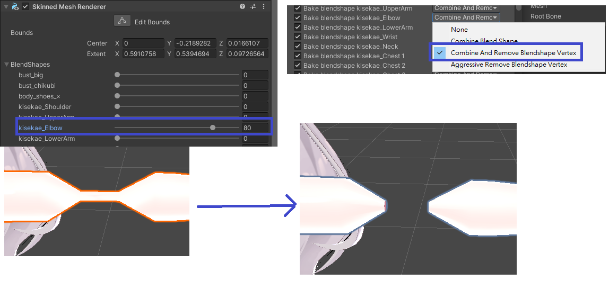
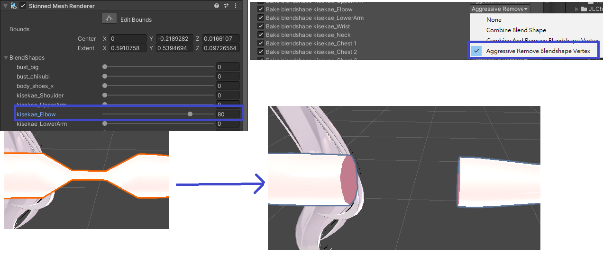
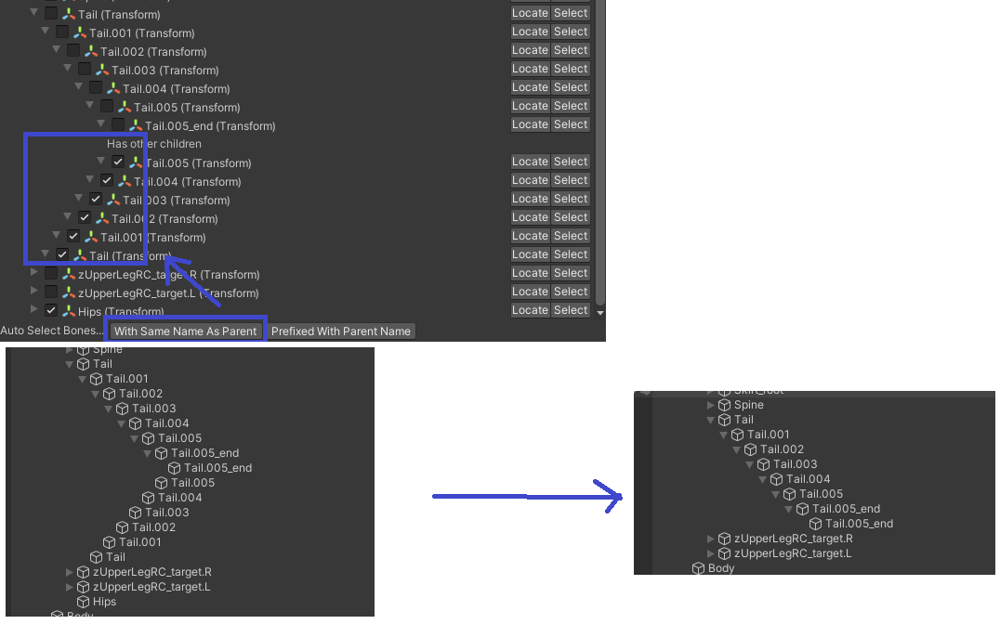
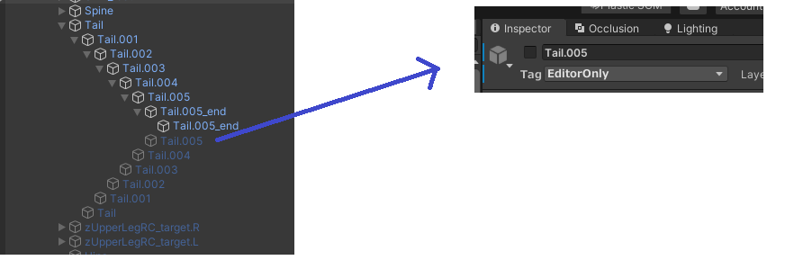

Skinned Mesh Combiner
=====================

> [!WARNING]
> **Deprecation Notice**  
> We are migrating this component into AvaUtils, a package bundle contains miscellaneous tools for manipulating an avatar within Unity.
> While download links are still valid in this repository, they will no longer updated for any bugs or new features.  
> https://github.com/JLChnToZ/avautils

This is an all-in-one utility that use to combine skinned mesh while preserving blendshapes and bones.
It is also capable to combine selected bones to its parent and bake selected blendshapes as well.
It is made with optimization on avatar models for metaverse such as VRChat in mind, but it does not depend on any framework except for Unity.

## Installation
You can install it with Unity package manager, or download in [release](https://github.com/JLChnToZ/SkinnedMeshCombiner/releases) or [Booth](https://xtl.booth.pm/items/4664467).

## How to use?

1. Open JLChnToZ > Tools > Skinned Mesh Combiner
2. Select the meshes or the game object contains the meshes you want to combine
3. Click the "+" button
4. Adjust the settings if you want
5. Click "Combine"

Here are the available options
- **Combine Meshes**: You can add skinned meshes and adjust options refer to the mesh itself such as blendshapes and materials.
  - **Remove sub meshes without materials**: You can remove a material from skinned mesh before combine to omit that portion.
    
  - **Remove mesh portions with missing bones**: If a portion of a mesh is binded to a bone no longer exists, it will simply removes it.
  - **Remove mesh portions with 0-scale bones**: You can remove portions of a mesh by setting the scale of bone(s) to 0.
    
  - **Bake blendshape xxx**/**Combine Blendshape**: Removes the blendshape while retains its effect.
    
  - **Combine and Remove Blendshape Vertex**: This feature is for removing "anti-penetration" vertices controlled by blendshapes.
    
  - **Aggressive Remove Blendshape Vertex**: Same as above, but the difference is it will removes triangles that partly connects to those vertices
    
  - **Destination**: You can manually assigns where to put the combined skinned mesh. If it is empty, it will automatically create a new game object to contain it.
  - **Blendshape Copy Mode**: Selects vetices/normals/tangents will be copied. Usually this option can leave untouched.
  - **Merge sub meshes with same material**: It is recommend to turn this on as it will reduces material slots.
  - **Select Unused Blendshapes**: It will automatically searches animator and other components (Avatar Descriptor from VRChat SDK, for example) and detects if a blendshape is refereced or not. If there is no references and it was not selected, it will automatically switch to combine mode.
  - **Deselect In-Use Blendshapes**: Similar to above, but instead of selecting more blendshapes to combine, it deselects blendshapes has references.
- **Combine Bones**: You can explicitly selects the bones to merge upwards here. "Upwards" means to its parent.
  
- **Blendshape Rename**: As the label suggests, you can rename blendshapes in this tab, which will applies to the combined mesh.
- **Cleanup**: Here is options for cleaning up after combine. Normally it will be done automatically, but you can find which objects unable to be removed as it sill have reference somewhere in the scene.
   If an object is part of a prefab instance, this tool will not remove them, instead it will disable it and change its tag to "EditorOnly", which will be omitted on build.
  - **Auto Cleanup on Combine**: You can uncheck this if you want to cleanup yourself.

## LICENSE
[MIT](LICENSE)